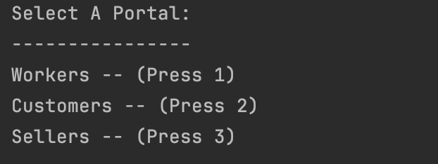
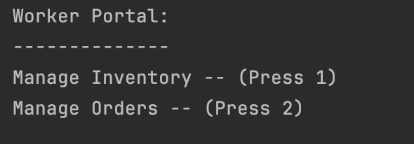
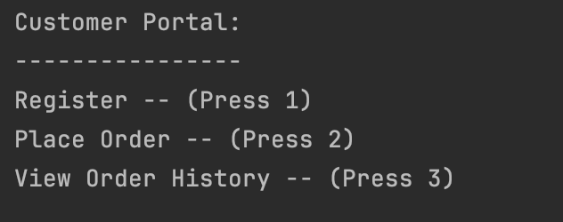
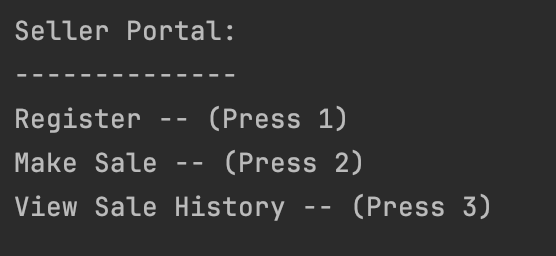
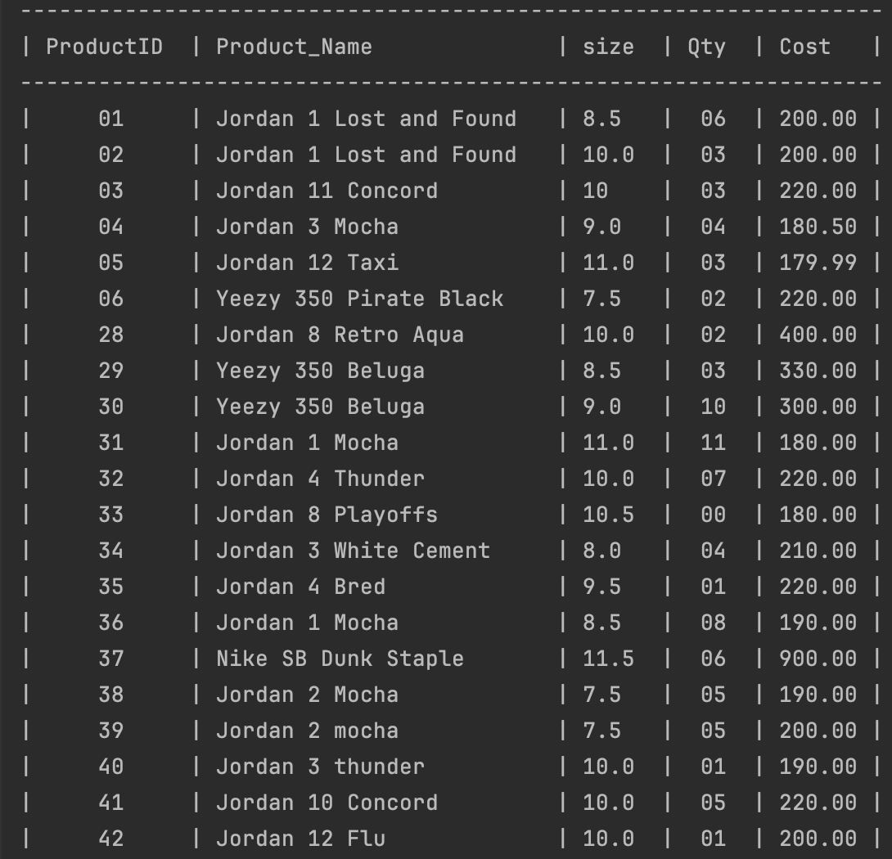

# CS 315 (Modern Database Management) Project

This is a CLI application that acts as a portal for a mock e-commerce sneaker store. The sneaker store acts as a marketplace, enabling users to be either buyers or sellers. 
Additionally, workers can also manage inventory and orders.

## Schema

## Portals
Upon initialization, a user can select a portal from the following options:

### Worker Portal
Options for the worker portal:

### Customer Portal
Options for the customer portal:

### Seller Portal
Options for the seller portal:

## Example use

A list of available inventory from the worker portal:

