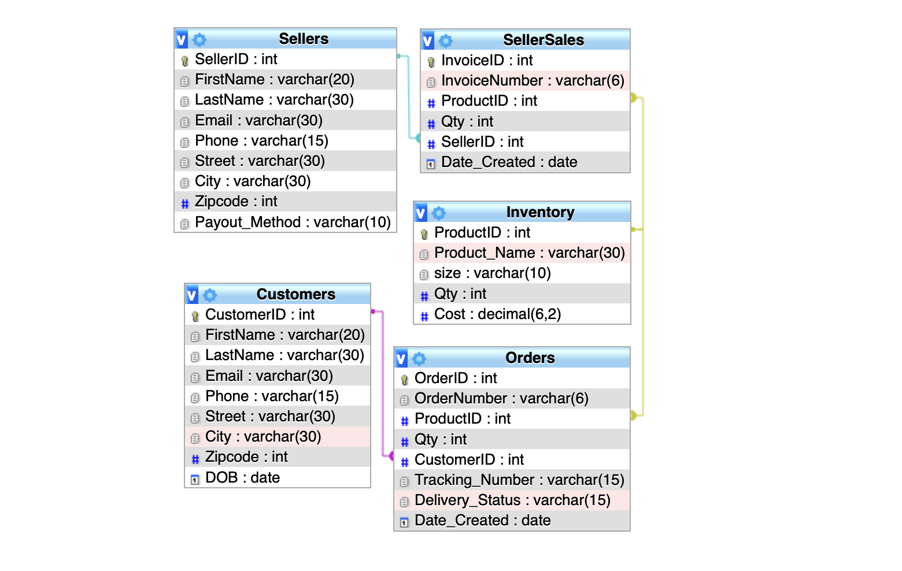

# CS 315 (Modern Database Management) Project

This is a CLI application that acts as a portal for a mock e-commerce sneaker store. The sneaker store acts as a marketplace, enabling users to be either buyers or sellers. 

## Schema
